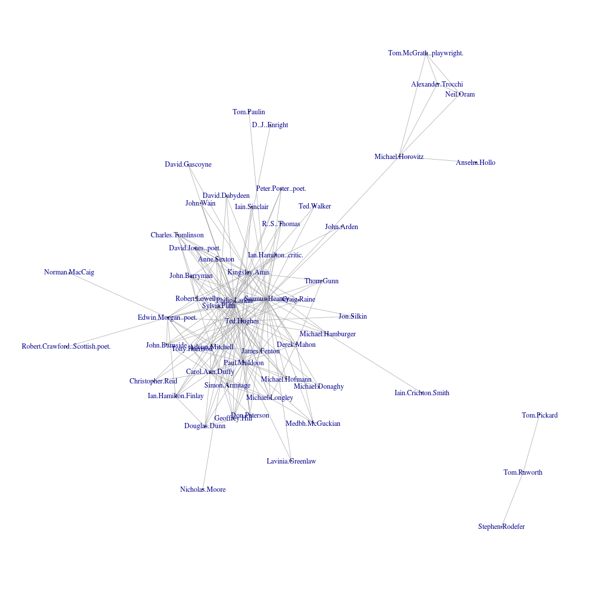

# coterie

Tools for basic social network analysis, intended to be applied to literary coteries but potentially useful for other things. Current components are listed below, with more to follow eventually.

Poets from *The New Poetry* (1966 edn., ed. by Al Alvarez), *Children of Albion* (1969, ed. by Michael Horovitz), *A Various Art* (1987, ed. by Andrew Crozier and Tim Longville), *Conductors of Chaos* (1996, ed. by Iain Sinclair) and the 1994 'New Generation Poets' list with at least ten shared links between their Wikipedia articles.

## wiki.py

*Requirements*: Python 3 (though easily modifiable to work with 2.x), NLTK and the [Wikipedia](https://github.com/goldsmith/Wikipedia) API wrapper for Python.

*Usage*:

    python wiki.py [input.txt] [output.csv] [--3grams OR --links]

This script takes a line-by-line list of Wikipedia article titles (e.g. a list of poets' names), looks up either common trigrams or links shared between them, then outputs the resulting data as a labelled and weighted adjacency matrix, suitable for processing in a stats package like R.

## wiki.R

*Requirements*: R and its package igraph.

*Usage*:

    Rscript wiki.R [input.csv] [output.png] [cut-off number]

Working with the output of the script above, this short R script plots a graph using the Fruchterman-Reingold algorithm and saves it as a PNG image. Edges with weights lower than the cut-off number will not be included.
